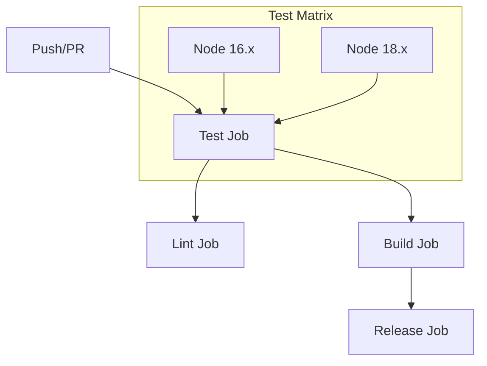

# GitHub Actions CI/CD Guide

This guide explains our CI/CD pipeline, how to monitor it, and how to manage GitHub Actions effectively.

## Current Pipeline Overview



## Pipeline Stages

### 1. Test Stage
- **Trigger**: Every push and pull request
- **Matrix**: Tests on Node.js 16.x and 18.x
- **Steps**:
  1. Checkout code
  2. Setup Node.js
  3. Install dependencies
  4. Run tests
  5. Run linting

### 2. Build Stage
- **Trigger**: Only on pushes to main
- **Prerequisites**: Test stage must pass
- **Steps**:
  1. Checkout code
  2. Setup Node.js
  3. Install dependencies
  4. Build extension
  5. Create release (if tagged)

## Monitoring Your Pipeline

### GitHub Actions Dashboard
1. Go to your repository
2. Click "Actions" tab
3. View:
   - Recent workflow runs
   - Workflow status
   - Job details
   - Test results
   - Build artifacts

### Key Metrics to Monitor
1. **Success Rate**
   - Percentage of successful runs
   - Common failure points
   - Test flakiness

2. **Build Time**
   - Total pipeline duration
   - Individual job duration
   - Caching effectiveness

3. **Resource Usage**
   - GitHub Actions minutes
   - Storage usage
   - Artifact size

## Managing GitHub Actions

### 1. Workflow Triggers
```yaml
on:
  push:
    branches: [ main ]
  pull_request:
    branches: [ main ]
```
- **Current**: Triggers on main branch pushes and PRs
- **Customization Options**:
  - Add more branches
  - Add specific paths
  - Add manual triggers

### 2. Environment Variables
```yaml
env:
  GITHUB_TOKEN: ${{ secrets.GITHUB_TOKEN }}
```
- **Current**: Using default GitHub token
- **Adding Secrets**:
  1. Go to repository Settings
  2. Navigate to Secrets and Variables
  3. Add new repository secrets

### 3. Caching Strategy
```yaml
with:
  cache: 'npm'
```
- **Current**: Caching npm dependencies
- **Optimization Options**:
  - Add more cache paths
  - Implement custom cache keys
  - Cache build artifacts

## Common Issues and Solutions

### 1. Flaky Tests
**Symptoms**:
- Intermittent test failures
- Different results on different Node versions

**Solutions**:
```yaml
jobs:
  test:
    strategy:
      matrix:
        node-version: [16.x, 18.x]
    steps:
      - name: Run tests with retry
        run: |
          npm test || npm test || npm test
```

### 2. Build Failures
**Symptoms**:
- Missing dependencies
- Incorrect file paths
- Permission issues

**Solutions**:
```yaml
jobs:
  build:
    steps:
      - name: Debug build
        run: |
          ls -la
          pwd
          echo $GITHUB_WORKSPACE
```

### 3. Release Issues
**Symptoms**:
- Failed artifact uploads
- Missing files
- Permission denied

**Solutions**:
```yaml
jobs:
  release:
    steps:
      - name: Verify artifacts
        run: |
          ls -la dist/
          du -sh dist/
```

## Best Practices

### 1. Workflow Organization
- Keep workflows focused and modular
- Use reusable workflows for common tasks
- Implement proper job dependencies

### 2. Security
- Use minimal permissions
- Rotate secrets regularly
- Scan dependencies

### 3. Performance
- Implement effective caching
- Parallelize jobs where possible
- Clean up artifacts regularly

## Monitoring Tools

### 1. GitHub Actions Insights
- Access via repository Insights tab
- View:
  - Workflow run history
  - Job duration trends
  - Success/failure rates

### 2. External Monitoring
Consider integrating:
- Status badges in README
- Slack notifications
- Email alerts

## Example Status Badge
```markdown

```

## Future Improvements

### 1. Pipeline Enhancements
- Add performance testing
- Implement automated versioning
- Add deployment stages

### 2. Monitoring Enhancements
- Add custom metrics
- Implement alerting
- Create dashboards

### 3. Security Enhancements
- Add security scanning
- Implement dependency updates
- Add compliance checks

## Conclusion

Our CI/CD pipeline ensures code quality and reliable releases. Regular monitoring and maintenance are essential for keeping the pipeline efficient and effective. Use this guide as a reference for managing and improving the pipeline. 