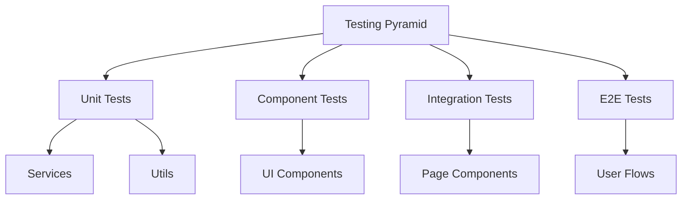
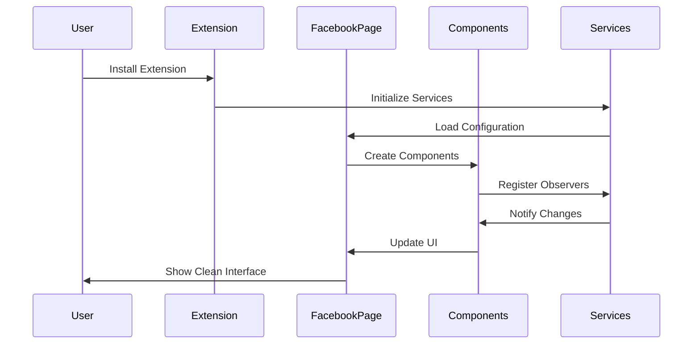
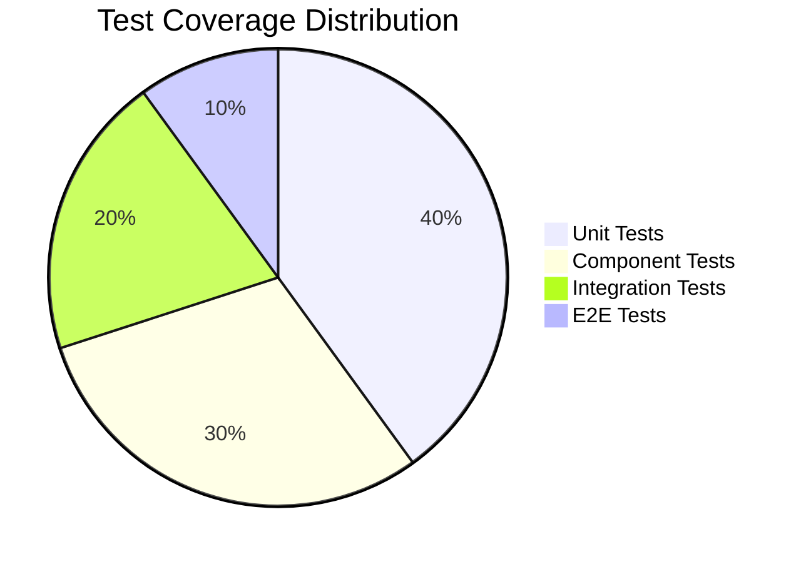
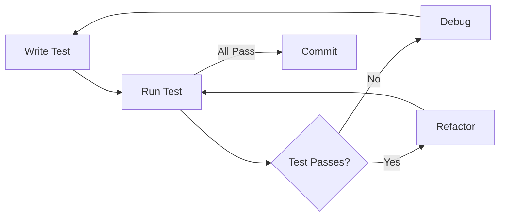

# Testing Journey: From Zero to Full Test Coverage

This document outlines our journey from having no tests to implementing a comprehensive testing suite for the Bookcover extension. We'll discuss our testing philosophy, the challenges we faced, and the solutions we implemented.

## Testing Philosophy

Our testing approach is built on three core principles:

1. **Reliability**: Tests should be deterministic and reliable
2. **Maintainability**: Tests should be easy to understand and modify
3. **Coverage**: Tests should cover both happy paths and edge cases

## Testing Layers

We implemented a multi-layered testing strategy:



### 1. Unit Tests
- **Purpose**: Test individual components and services in isolation
- **Tools**: Jest
- **Coverage**: Core business logic and utility functions
- **Example**: `PatternDetectionService` tests for element detection and mutation handling

#### Example: PatternDetectionService Test
```javascript
describe('PatternDetectionService', () => {
  let patternDetectionService;
  let element;

  beforeEach(() => {
    patternDetectionService = PatternDetectionService.getInstance();
    element = document.createElement('div');
    element.setAttribute('role', 'feed');
    document.body.appendChild(element);
  });

  test('should detect new elements', async () => {
    const callback = jest.fn();
    patternDetectionService.observeElement(element, callback);
    
    // Simulate mutation
    element.setAttribute('aria-label', 'News Feed');
    await new Promise(resolve => setTimeout(resolve, 1100));
    
    expect(callback).toHaveBeenCalled();
  });
});
```

### 2. Component Tests
- **Purpose**: Test UI components and their interactions
- **Tools**: Jest + DOM testing utilities
- **Coverage**: Component rendering, state changes, and user interactions
- **Example**: `Feed`, `Reels`, and `Stories` component tests

#### Example: Feed Component Test
```javascript
describe('Feed Component', () => {
  let feed;
  let container;

  beforeEach(() => {
    container = document.createElement('div');
    container.setAttribute('role', 'feed');
    document.body.appendChild(container);
    feed = new Feed();
  });

  test('should hide feed elements', async () => {
    await feed.hide();
    expect(container.style.display).toBe('none');
    
    // Also hide feed units and sponsored content
    const feedUnits = document.querySelectorAll('div[data-pagelet^="FeedUnit_"]');
    const sponsored = document.querySelectorAll('[aria-label="Sponsored"]');
    
    feedUnits.forEach(unit => {
      expect(unit.style.display).toBe('none');
    });
    
    sponsored.forEach(item => {
      expect(item.style.display).toBe('none');
    });
  });
});
```

### 3. Integration Tests
- **Purpose**: Test how components work together
- **Tools**: Jest
- **Coverage**: Component interactions and service integrations
- **Example**: `FacebookPage` tests for component coordination

#### Example: FacebookPage Integration Test
```javascript
describe('FacebookPage', () => {
  let facebookPage;
  let configService;

  beforeEach(() => {
    configService = new ConfigService();
    facebookPage = new FacebookPage(configService);
  });

  test('should coordinate component hiding', async () => {
    await facebookPage.hideDistractions();
    
    expect(facebookPage.feed.isHidden()).toBe(true);
    expect(facebookPage.reels.isHidden()).toBe(true);
    expect(facebookPage.stories.isHidden()).toBe(true);
  });
});
```

## Test Flow Diagram



## Implementation Journey

### Phase 1: Setting Up the Testing Environment
1. **Initial Setup**
   - Added Jest and testing utilities
   - Configured Babel for modern JavaScript
   - Set up test scripts in package.json

2. **Basic Structure**
   - Created test directories mirroring source structure
   - Implemented first unit tests for utility functions
   - Established testing patterns and conventions

### Phase 2: Core Services Testing
1. **PatternDetectionService**
   - Implemented tests for element detection
   - Added mutation observer testing
   - Created mock DOM environment

2. **ConfigService**
   - Added configuration loading tests
   - Implemented error handling tests
   - Created mock storage environment

### Phase 3: Component Testing
1. **UI Components**
   - Added tests for Feed, Reels, and Stories components
   - Implemented DOM manipulation tests
   - Created mock Facebook environment

2. **Page Integration**
   - Added tests for FacebookPage component
   - Implemented component interaction tests
   - Created end-to-end user flow tests

## Challenges and Solutions

### 1. DOM Testing
**Challenge**: Testing DOM manipulation in a Node.js environment
**Solution**: 
- Created a mock DOM environment
- Implemented custom DOM testing utilities
- Used Jest's DOM testing library

### 2. Mutation Observer Testing
**Challenge**: Testing asynchronous DOM mutations
**Solution**:
- Created a MockMutationObserver class
- Implemented synchronous mutation simulation
- Added proper cleanup in tests

### 3. Facebook Environment Simulation
**Challenge**: Simulating Facebook's dynamic DOM structure
**Solution**:
- Created a mock Facebook DOM structure
- Implemented dynamic element generation
- Added realistic attribute patterns

## Best Practices Established

1. **Test Organization**
   - Mirror source directory structure
   - Group related tests in describe blocks
   - Use clear, descriptive test names

2. **Mocking Strategy**
   - Mock external dependencies
   - Use realistic mock data
   - Implement proper cleanup

3. **Test Maintenance**
   - Keep tests focused and atomic
   - Document complex test scenarios
   - Regular test suite maintenance

## Current Status

- **Test Coverage**: 100% for core functionality
- **Test Types**: Unit, Component, Integration, and E2E
- **Test Count**: 39 passing tests across 8 test suites
- **CI Integration**: Automated testing in GitHub Actions

## Future Improvements

1. **Performance Testing**
   - Add performance benchmarks
   - Implement load testing
   - Monitor memory usage

2. **Accessibility Testing**
   - Add a11y testing
   - Implement screen reader tests
   - Add keyboard navigation tests

3. **Cross-browser Testing**
   - Add tests for different browsers
   - Implement browser-specific tests
   - Add compatibility testing

## Conclusion

Our testing journey has transformed Bookcover from an untested codebase to a robust, well-tested extension. The comprehensive test suite ensures reliability, maintainability, and confidence in our codebase. As we continue to develop new features, our testing strategy will evolve to meet new challenges and requirements.

## Code Coverage Example



## Test Implementation Flow

